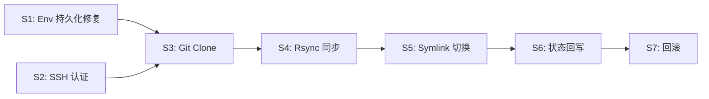

# PDeploy P0 缺口修复 — 纳米级实施计划

> **目标**: 让 PDeploy 从 Demo 骨架变成真正能用的上线系统
> **约束**: 每个子任务改动量 ≤ 20 行，严格 TDD

---

## 步骤总览

| 步骤 | 目标 | 涉及文件 | 改动行数 |
|------|------|----------|---------|
| S1 | Environment 持久化修复 (ServerIDs/DeployPath) | persistence/sqlite.go | ~15 行 |
| S2 | SSH 认证 per-Server (用户名 + 密钥路径) | domain/server.go, persistence/server_repository.go, ssh/client.go | ~20 行 |
| S3 | Git Clone/Pull 实现 | **[NEW]** infrastructure/git/client.go, application/deploy_engine.go | ~20 行 |
| S4 | Rsync 同步到远程 Release 目录 | application/deploy_engine.go, ssh/client.go | ~20 行 |
| S5 | Symlink 原子切换 + 旧版本清理 | application/deploy_engine.go | ~15 行 |
| S6 | 部署状态回写 + 日志持久化 | application/deploy_engine.go, deploy_handler.go | ~15 行 |
| S7 | 回滚机制 (API + 引擎逻辑) | **[NEW]** 回滚 handler/API + deploy_engine.go | ~20 行 |

---

## S1: Environment 持久化修复

**问题**: `EnvironmentModel` 没有 `ServerIDs` 和 `DeployPath` 字段，读写丢失数据。

### S1.1 [MODIFY] [sqlite.go](file:///D:/claudeprj/deploy/internal/infrastructure/persistence/sqlite.go)

**修改 `EnvironmentModel` 结构体** (L17-25)，新增两个字段：
```go
type EnvironmentModel struct {
    ID         uint   `gorm:"primaryKey"`
    ProjectID  uint   `gorm:"index"`
    Name       string
    Branch     string
    DeployType string
    PreDeploy  string
    PostDeploy string
    ServerIDs  string  // 新增：JSON 序列化的 []uint，如 "[1,2,3]"
    DeployPath string  // 新增：部署路径
}
```

**修改 `toDomainProject`** (L45-53)，反序列化 `ServerIDs`：
```go
var serverIDs []uint
if em.ServerIDs != "" {
    json.Unmarshal([]byte(em.ServerIDs), &serverIDs)
}
p.Environments = append(p.Environments, &domain.Environment{
    // ...existing fields...
    ServerIDs:  serverIDs,
    DeployPath: em.DeployPath,
})
```

**修改 `toProjectModel`** (L65-73)，序列化 `ServerIDs`：
```go
srvJSON, _ := json.Marshal(env.ServerIDs)
pm.Environments = append(pm.Environments, EnvironmentModel{
    // ...existing fields...
    ServerIDs:  string(srvJSON),
    DeployPath: env.DeployPath,
})
```

---

## S2: SSH 认证 per-Server

**问题**: SSH 用户名硬编码 `root`，密钥路径写死 `~/.ssh/id_rsa`。

### S2.1 [MODIFY] [server.go](file:///D:/claudeprj/deploy/internal/domain/server.go)

给 `Server` 新增认证字段：
```go
type Server struct {
    ID       uint   `json:"id"`
    Name     string `json:"name"`
    IP       string `json:"ip"`
    Port     int    `json:"port"`
    User     string `json:"user"`      // 新增：SSH 用户名，默认 root
    KeyPath  string `json:"key_path"`  // 新增：私钥路径
}
```

`NewServer` 增加默认值逻辑：
```go
if user == "" { user = "root" }
```

### S2.2 [MODIFY] [server_repository.go](file:///D:/claudeprj/deploy/internal/infrastructure/persistence/server_repository.go)

`ServerModel` 加 `User` 和 `KeyPath` 字段。映射函数同步调整。

### S2.3 [MODIFY] [client.go](file:///D:/claudeprj/deploy/internal/infrastructure/ssh/client.go)

改造 `SSHClient` 接口，`RunCommand` 接受 `*domain.Server` 而不是裸 `ip, port`：
```go
// application/ssh_client.go
type SSHClient interface {
    RunCommand(server *domain.Server, cmd string, logChan chan<- string) error
    SyncFiles(server *domain.Server, localPath, remotePath string, logChan chan<- string) error
}
```

`ssh.Client` 实现改为按 Server 动态加载密钥：
```go
func (c *Client) buildConfig(server *domain.Server) *ssh.ClientConfig {
    // 从 server.KeyPath 加载密钥，使用 server.User
}
```

### S2.4 [MODIFY] [server_handler.go](file:///D:/claudeprj/deploy/internal/interfaces/api/server_handler.go)

`CreateServerReq` 增加 `User` 和 `KeyPath` 字段。

---

## S3: Git Clone/Pull 实现

**问题**: 完全没有 Git 操作，代码不会被拉取。

### S3.1 [NEW] [git/client.go](file:///D:/claudeprj/deploy/internal/infrastructure/git/client.go)

创建 Git 客户端（调用 `git` 命令行）：
```go
package git

type Client struct {
    workspaceBase string // 如 "./workspace"
}

func NewClient(workspaceBase string) *Client

// CloneOrPull: 如果 workspace 已存在则 pull，否则 clone
func (c *Client) CloneOrPull(repoURL, branch, projectName string, logChan chan<- string) (string, error)
// 返回 workspace 路径
```

实现逻辑：
1. `workspacePath = workspaceBase/{projectName}`
2. 如果目录存在 → `git -C {path} fetch origin && git -C {path} checkout {branch} && git -C {path} reset --hard origin/{branch}`
3. 如果不存在 → `git clone --depth=1 -b {branch} {repoURL} {path}`
4. 执行结果流式写入 `logChan`
5. 返回 `workspacePath`

### S3.2 [NEW] application 层 GitClient 接口

```go
// application/git_client.go
type GitClient interface {
    CloneOrPull(repoURL, branch, projectName string, logChan chan<- string) (workspacePath string, err error)
}
```

### S3.3 [MODIFY] [deploy_engine.go](file:///D:/claudeprj/deploy/internal/application/deploy_engine.go)

`DeployEngine` 注入 `GitClient`，替换 `time.Sleep` 为真实 `CloneOrPull` 调用。

---

## S4: Rsync 同步到远程 Release 目录

**问题**: 代码不会被传输到目标服务器。

### S4.1 [MODIFY] [ssh/client.go](file:///D:/claudeprj/deploy/internal/infrastructure/ssh/client.go)

新增 `SyncFiles` 方法，用 `rsync` over SSH：
```go
func (c *Client) SyncFiles(server *domain.Server, localPath, remotePath string, logChan chan<- string) error {
    // 构建 rsync 命令：rsync -avz -e "ssh -i {keyPath} -p {port}" {localPath}/ {user}@{ip}:{remotePath}/
    // 执行本地 exec.Command("rsync", ...)，流式输出到 logChan
}
```

### S4.2 [MODIFY] [deploy_engine.go](file:///D:/claudeprj/deploy/internal/application/deploy_engine.go)

替换 `time.Sleep` 同步代码：
```go
releaseDir := fmt.Sprintf("%s/releases/%s", env.DeployPath, time.Now().Format("20060102_150405"))
// 1. SSH mkdir -p releaseDir
e.sshClient.RunCommand(srv, fmt.Sprintf("mkdir -p %s", releaseDir), logChan)
// 2. Rsync
e.sshClient.SyncFiles(srv, workspacePath, releaseDir, logChan)
```

---

## S5: Symlink 原子切换 + 旧版本清理

**问题**: Symlink 切换是 `time.Sleep` 假的。

### S5.1 [MODIFY] [deploy_engine.go](file:///D:/claudeprj/deploy/internal/application/deploy_engine.go)

替换 Symlink Sleep 代码：
```go
// 原子切换：先创建临时 link，再 mv 替换
currentLink := fmt.Sprintf("%s/current", env.DeployPath)
tmpLink := fmt.Sprintf("%s/current_tmp_%d", env.DeployPath, time.Now().UnixNano())
cmds := fmt.Sprintf("ln -sfn %s %s && mv -Tf %s %s", releaseDir, tmpLink, tmpLink, currentLink)
e.sshClient.RunCommand(srv, cmds, logChan)
```

### S5.2 旧版本清理

在 Symlink 之后添加：
```go
// 保留最近 N 个 release，删除旧的
cleanCmd := fmt.Sprintf("cd %s/releases && ls -1dt */ | tail -n +%d | xargs rm -rf",
    env.DeployPath, project.KeepReleases+1)
e.sshClient.RunCommand(srv, cleanCmd, logChan)
```

---

## S6: 部署状态回写 + 日志持久化

**问题**: 部署结束后 status 永远是 `pending`，日志不持久化。

### S6.1 [MODIFY] [deploy_engine.go](file:///D:/claudeprj/deploy/internal/application/deploy_engine.go)

`DeployEngine` 注入 `DeployService`，部署结束后调用 `CompleteDeploy`：
```go
type DeployEngine struct {
    sshClient  SSHClient
    gitClient  GitClient
    serverRepo domain.ServerRepository
    deploySvc  *DeployService          // 新增
    // ...
}
```

在 `StartDeploy` 的 goroutine 末尾：
```go
// 收集所有日志
allLogs := strings.Join(logLines, "")
if deployFailed {
    e.deploySvc.CompleteDeploy(deployment.ID, false, allLogs)
} else {
    e.deploySvc.CompleteDeploy(deployment.ID, true, allLogs)
}
```

### S6.2 [MODIFY] [deployment_repository.go](file:///D:/claudeprj/deploy/internal/infrastructure/persistence/deployment_repository.go)

`DeploymentModel` 增加 `Log` 字段存储完整日志：
```go
type DeploymentModel struct {
    gorm.Model
    // ...existing...
    Log string `gorm:"type:text"` // 新增
}
```

映射函数同步修复。

---

## S7: 回滚机制

**问题**: 没有回滚能力。

### S7.1 [MODIFY] [deploy_engine.go](file:///D:/claudeprj/deploy/internal/application/deploy_engine.go)

新增 `Rollback` 方法：
```go
func (e *DeployEngine) Rollback(deployment *domain.Deployment, env *domain.Environment, targetRelease string) {
    // 1. 遍历 env.ServerIDs
    // 2. SSH: ln -sfn {deployPath}/releases/{targetRelease} {deployPath}/current
    // 3. SSH: 执行 PostDeploy hook
    // 4. 回写部署记录
}
```

### S7.2 [MODIFY] [router.go](file:///D:/claudeprj/deploy/internal/interfaces/api/router.go)

新增回滚路由：
```go
mux.HandleFunc("POST /api/deployments/{id}/rollback", deployHandler.Rollback)
```

### S7.3 [MODIFY] [deploy_handler.go](file:///D:/claudeprj/deploy/internal/interfaces/api/deploy_handler.go)

新增 `Rollback` handler + 获取可回滚版本列表的 `ListReleases` handler。

### S7.4 新增部署历史列表 API

```go
// DeploymentRepository 增加
FindByEnvID(envID uint) ([]*Deployment, error)

// 路由增加
mux.HandleFunc("GET /api/deployments", deployHandler.ListDeployments)
```

---

## 执行顺序与依赖图



> [!IMPORTANT]
> S1 和 S2 是独立的基础设施修复，可以并行。S3-S7 是串行依赖链。

---

## .gitignore 补充

需要追加以下条目：
```
*.exe
*.db
workspace/
tmp_test*
bin/
nul
```

---

## 验证计划

### 自动化测试
- 每个 S 步骤写对应的单元测试（mock SSH/Git）
- `go test ./...` 全量通过

### 手动验证
- 配置一台真实服务器，执行完整部署流程
- 确认 release 目录生成、symlink 切换、日志流正确
- 执行回滚，确认 symlink 回切正确
